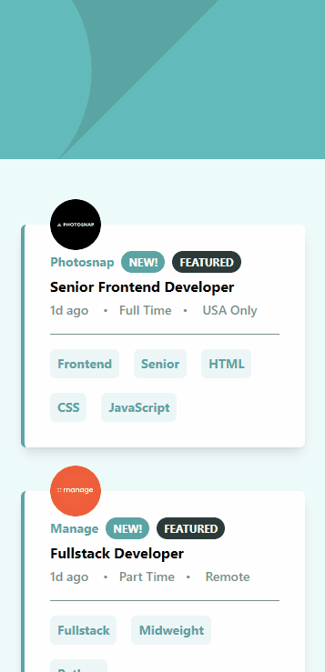
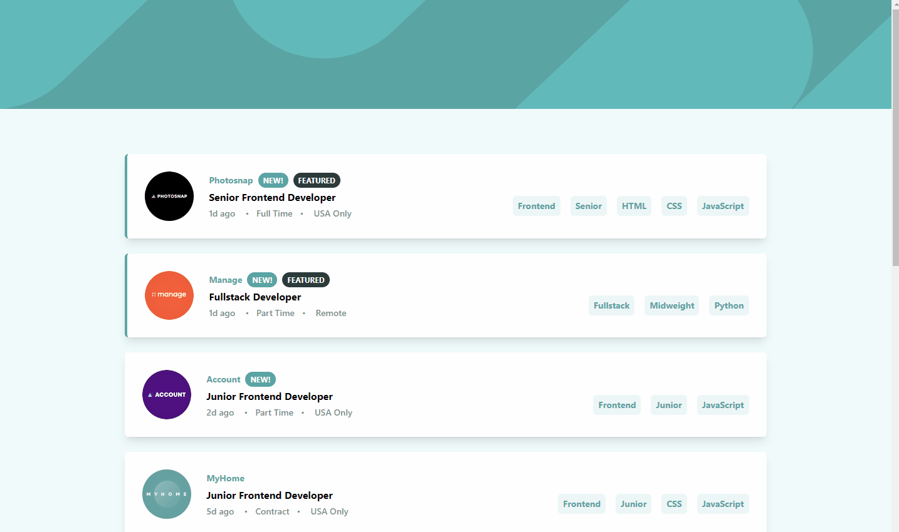

# Frontend Mentor - Job listings with filtering

This is a solution to the [Job listings with filtering](https://www.frontendmentor.io/challenges/job-listings-with-filtering-ivstIPCt). Frontend Mentor challenges help you improve your coding skills by building realistic projects. 

## Table of contents

- [Overview](#overview)
  - [Screenshot](#screenshot)
  - [Links](#links)
- [My process](#my-process)
  - [Built with](#built-with)
  - [What I learned](#what-i-learned)

## Overview

### Screenshot

#### Mobile

#### Desktop

### Links
 - Live Site URL: https://job-listings-with-filtering-beta.vercel.app/

## My process

### Built with
- [Vite](https://vitejs.dev/) - bundler
- [React](https://reactjs.org/) - JS library
- [Prop Types](https://www.npmjs.com/package/prop-types) - JS library
- [TailwindCSS](https://tailwindcss.com/docs/installation) - For styles

### What I learned

- Used tailwindCss for styled components
- Used Vite Bundler for start project
- Used Eslint for source code standardization

